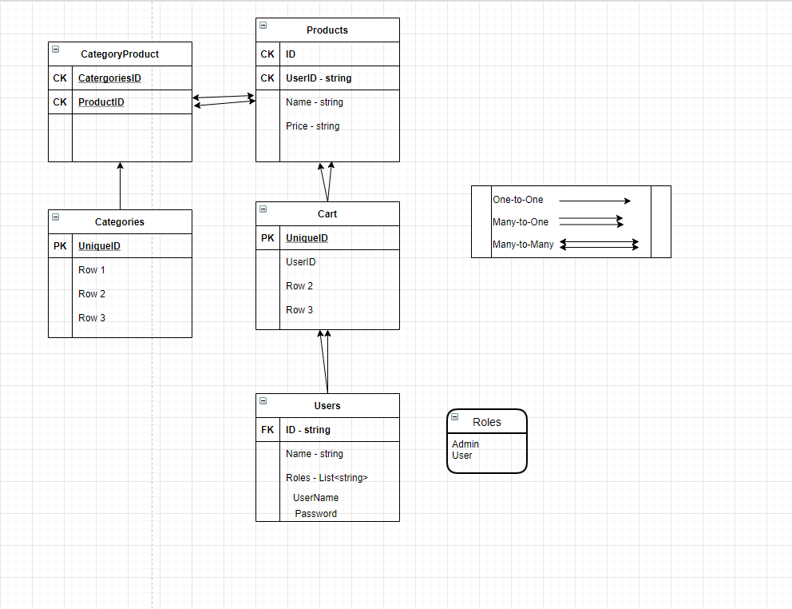

# Welcome to InterGalactic-Ecomm!

## Authors:

Scott Falbo + Matthew Petersen 

## Summary:
We are in the process of creating an Ecommerce website. Users will be able to register and login with a username and password. When a user is registered an access_token is generated and is used to authenticate+authorize the user to login. 

At the moment we are using a HomeController with mock data to test that our front-end is able to pull some easy information.

## ERD

### Change Log:
2/15/2021 - Scaffolded out files, started working on jwt + user login. Seeded products + categories to db.
