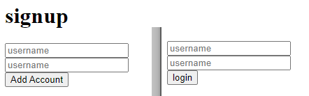

# Welcome to InterGalactic-Ecomm!

## Authors:

Scott Falbo | Matthew Petersen

*version 1.0.1*

---

## Overview:
We are in the process of creating an E-commerce website. Users will be able to register and login with a username and password. When a user is registered an access_token is generated and is used to authenticate+authorize the user to login.

At the moment we are using a HomeController with mock data to test that our front-end is able to pull some easy information.

---

## Getting Started
+ `git clone https://scottfalboart@dev.azure.com/scottfalboart/InterGalactic-Ecomm/_git/InterGalactic-Ecomm`
+ Open the project in Visual Studio or compile it from the command line.
+ You can successfully register an account via the register link on the home page.  Once registered you will be redirected to login.
  + Then nothing happens...

## Example

---

## Architecture

  
  
  

This is an ASP.Net Core App built in an MVC framework, that utilizes Microsoft Framework Identity to register and authenticate users.  

Product and Category data is stored in a SQL database using NewtonSoftJson to parse the json.

## ERD

### Change Log:
+ *02/15/2021* - Scaffolded out files, started working on jwt and user login. Seeded products and categories to db.
+ *02/16/2021* - Brought in Identity dependencies.
+ Created user roles and policies.  Added permissions to routes.
+ Made forms for registering a user, and then subsequently logging in as that user.

---

## Attribution
+ As always thank you to John Cokos, Bade Habib, and Phil Werner for the instruction and assists.